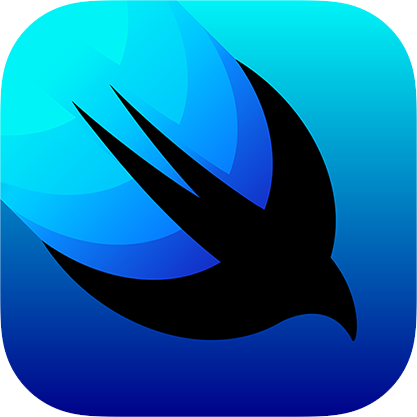

<a href="https://www.linkedin.com/in/heeyunlee/"></img></a>
&nbsp;

# 👋 Hello!

I am Heeyun Lee, a sofware engineer working with Flutter, Swift, and more.

- 📈 I am currently working as a software engineer at [dub](https://www.dubapp.com/), the US's first copy-trading platform.
- 💻 Previously, I worked as a software engineer at [Tonal](https://www.tonal.com/)’s mobile team, the world’s smartest home gym and personal trainer.
- 🪖 I served in the Republic of Korea Marine Corps as a Signal Corpsman for two years.
- 🎓I graduated from Pace University, double majoring in Business Analytics and Finance.

## Projects

### CCCC: Expense Tracker, Automatic Calorie Counter

- CCCC is a nutrition-focued expense tracker and automatic calorie counter. I used Plaid API to connect to
  - [Github Repo](https://github.com/heeyunlee/cccc)

## ⚒️ Languages & Tools

<a href="https://dart.dev/"></img></a>
&nbsp;
<a href="https://www.python.org/"></img></a>
&nbsp;
<a href="https://www.r-project.org/"></img></a>
&nbsp;
<a href="https://developer.apple.com/swift/"></img></a>
&nbsp;

<a href="https://flutter.dev/"></img></a>
&nbsp;
<a href="https://developer.apple.com/xcode/swiftui/"></img></a>
&nbsp;

<a href="https://firebase.google.com/"></img></a>
&nbsp;
<a href="https://code.visualstudio.com/"></img></a>
&nbsp;

[Business Analytics]: https://www.pace.edu/program/business-analytics-bba
